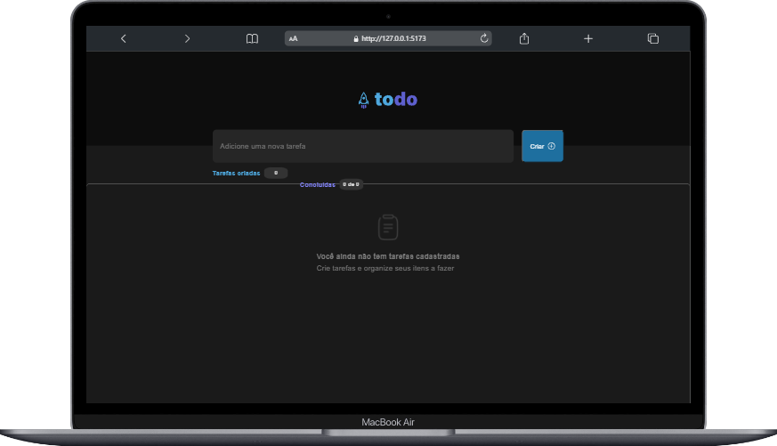
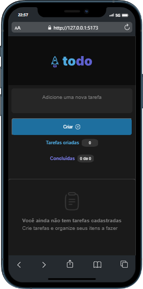

<br />
<div align="center">
  <a href="https://github.com/othneildrew/Best-README-Template">
    
  </a>

  <h3 align="center">To-do List Projeto Ignite</h3>

  <p align="center">
    <br />
    <a href="https:/ignitetodo-list.vercel.app/dashboard">Demo do projeto</a>
  </p>
</div>


## Sobre o Projeto
<br />
<!--[![Screen Shot][product-screenshot]](/mobile.png)
[![Screen Shot][product-screenshot]](/pc.png)-->
<div align="center">
  <br />
  <br />
  
</div>
<br />
Projeto desenvolvido, durante a trilha Ignite Frontend, no desafio do primeiro modulo.

Sobre o aplicativo:
- Adicionar uma nova tarefa
- Marcar e desmarcar uma tarefa como concluída
- Remover uma tarefa da listagem
- Mostrar o progresso de conclusão das tarefas

<p align="right">(<a href="#readme-top">Para o topo</a>)</p>


### Desenvolvido com :

<a href="https://reactjs.org/" target="_blank" rel="noreferrer">  </a>


<!-- GETTING STARTED -->
## Iniciar

1. Clonar o repo
   ```sh
   git clone https://github.com/ElvisFelix-dev/desafio-to-do-list-ignite.git
   ```
2. Abra a pasta
   ```sh
   cd desafio-to-do-list-ignite
   
3. Instalando NPM packages
   ```sh
   npm install
   ```
   
4. Iniciar 
   ```sh
   npm run dev
   ```

<p align="right">(<a href="#readme-top">Para o topo</a>)</p>


<!-- CONTACT -->
## Contato

 - <p align="left"> <a href="https://twitter.com/elvis__felix" target="blank"></a> </p>
<a href="https://linkedin.com/in/https://www.linkedin.com/in/elvis-felix" target="blank"></a>


<p align="right">(<a href="#readme-top">Para o topo</a>)</p>


